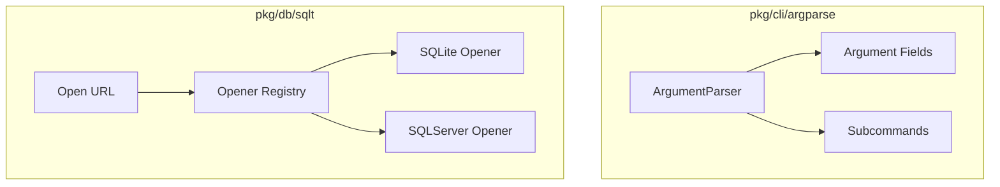

# Technical Architecture - go-minolas

This document outlines the technical architecture of the `go-minolas` shared packages.

## Package Architecture

- **ArgumentParser:** Translates input argument string arrays into target pointers (String, Bool, Int) with default value fallbacks.
- **Opener Registry:** Thread-safe registry mapping connection schemes to custom SQL openers implementing `CanOpen` and `Open`.
- **SQLite Opener:** Connects to file-based or in-memory SQLite databases using CGo-free `modernc.org/sqlite`.
- **SQLServer Opener:** Connects to Microsoft SQL Server/Azure SQL instances using `github.com/microsoft/go-mssqldb`.
